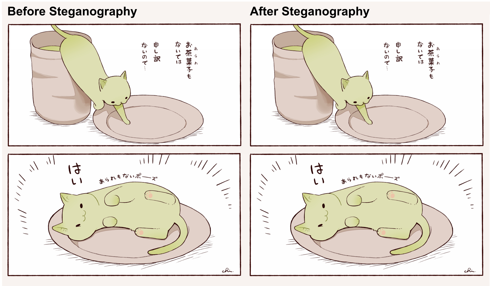

*Original image vs. steganography-embedded image — yet one contains hidden encrypted data\**

# Teehee~

[](LICENSE)
[](https://www.rust-lang.org/)

[](https://github.com)

> This project serves as a practical exploration of Rust's cryptographic ecosystem and systems programming capabilities.

## 📑 Table of Contents

- [Features](#-features)
- [Quick Start](#-quick-start)
- [Usage](#-usage)
  - [1. Embed a Message](#1-embed-a-message)
  - [2. Extract a Message](#2-extract-a-message)
  - [3. Check Image Capacity](#3-check-image-capacity)
- [Using as a Library](#-using-as-a-library)
- [Teehee~ Web](#teehee-web)
- [Features](#features)
- [Running the Web Application](#running-the-web-application)
- [Using the Web Interface](#using-the-web-interface)
- [API Endpoints](#api-endpoints)
- [Disclaimer](#-disclaimer)

## ✨ Features

- 🔐 **Build-Time Salt Encryption**: Each compiled binary embeds a unique cryptographic salt generated at build time, making every binary cryptographically distinct
- 🎨 **Fractal-Guided Embedding**: Uses fractal dimension analysis to intelligently select high-texture regions for data hiding, minimizing visual artifacts
- 🔑 **Dual-Layer Security**: Combines build-time salt with optional user passwords for multi-factor protection
- 📊 **STC Optimization**: Syndrome-Trellis Codes (STC) minimize embedding distortion while maximizing payload capacity
- 🛡️ **Authenticated Encryption**: AES-256-GCM ensures data integrity and prevents tampering
- 🎯 **Invisible Modifications**: Adaptive ±1 LSB matching preserves statistical properties of the carrier image

## 🚀 Quick Start

### Installation

```bash
cargo build --release
```

The executable will be located at `target/release/teehee` (or `teehee.exe` on Windows).

## 📖 Usage

### 1. Embed a Message


```bash
# Embed text message:
teehee embed -i cover.png -o stego.png -m "This is a secret message"

# Embed from file:
teehee embed -i cover.png -o stego.png -f secret.txt

# With custom password:
teehee embed -i cover.png -o stego.png -m "Secret" -k "my-password"

# With quality metrics:
teehee embed -i cover.png -o stego.png -m "Secret" -q
```

### 2. Extract a Message

```bash
# Extract and display:
teehee extract -s stego.png

# Extract to file:
teehee extract -s stego.png -O output.txt

# With custom password:
teehee extract -s stego.png -k "my-password"
```

### 3. Check Image Capacity

```bash
teehee info -i photo.png
```

This shows how many bytes of data can be hidden in the image.

## 🔧 Using as a Library

```rust
use teehee::TeeheeStego;
use image::io::Reader;

fn main() -> anyhow::Result<()> {
    // Load carrier image
    let carrier = Reader::open("cover.png")?.decode()?;
    
    // Create steganography engine
    let stego = TeeheeStego::new();
    
    // Embed message
    let message = b"This is a secret message";
    let stego_image = stego.embed(&carrier, message)?;
    stego_image.save("stego.png")?;
    
    // Extract message
    let extracted = stego.extract(&stego_image)?;
    assert_eq!(message.as_slice(), extracted.as_slice());
    
    Ok(())
}
```

# Teehee~ Web 

Teehee includes a web-based interface for steganography operations. The web application provides a user-friendly GUI for embedding and extracting hidden messages without using the command line.

## Features

- 🖼️ **Visual Interface**: Drag-and-drop image upload and interactive controls
- 🔑 **Session Management**: Secure, time-limited encryption sessions with automatic cleanup
- 🎯 **Smart Image Matching**: Automatically finds the best matching image for extraction when you can't remember which one was used
- 📊 **Real-time Stats**: Monitor capacity, quality metrics, and processing status
- 🔒 **Security**: CSRF protection, CSP headers, and secure session handling
- 🐳 **Docker Support**: Easy deployment with Docker and Docker Compose

## Running the Web Application

### Option 1: Using Cargo (Development)

```bash
cd web
cargo run --release
```

The server will start at `http://localhost:8080`

### Option 2: Using Docker Compose (Production)

```bash
cd web
docker-compose up -d
```

This will:
- Build and run the web application in a container
- Expose the service on port 8080
- Persist data in `./data`, `./workspaces`, and `./downloads` directories
- Automatically restart on failure

### Environment Variables

- `DATABASE_URL`: SQLite database path (default: `sqlite:data/teehee.db`)
- `RUST_LOG`: Logging level (default: `teehee_web=debug`)
- `WORKSPACES_DIR`: Directory for temporary workspaces (default: `./workspaces`)
- `DOWNLOADS_DIR`: Directory for generated files (default: `./downloads`)
- `ALLOWED_ORIGINS`: Comma-separated list of allowed CORS origins (optional)

## Using the Web Interface

1. **Embedding Messages**:
   - Navigate to `http://localhost:8080`
   - Upload a cover image
   - Enter your secret message or upload a file
   - (Optional) Set a custom password and TTL
   - Click "Encrypt & Embed" to generate the stego image
   - Download the result

2. **Extracting Messages**:
   - Upload the stego image (with embedded data)
   - Enter the password if one was used
   - Click "Decrypt & Extract" to reveal the hidden message
   
3. **Smart Extraction** (when you forget which image was used):
   - Upload multiple candidate images
   - The system will use perceptual hashing to find the best match
   - Automatically extract from the correct image

## API Endpoints

- `POST /api/encrypt/init` - Initialize encryption session
- `POST /api/encrypt/embed` - Embed message into image
- `POST /api/decrypt` - Extract message from stego image
- `GET /api/session/:id` - Get session status
- `GET /api/stats` - Get system statistics
- `GET /downloads/:file` - Download generated files

## ⚠️ Disclaimer

This tool is intended for legitimate and legal uses only. Users are responsible for their own actions.


\* *The sample image used in the demonstration (`readme.png`) is artwork by [チャイ](https://www.pixiv.net/users/1096811) on pixiv. The hidden message extracted from the steganography example is the artwork URL: https://www.pixiv.net/artworks/131246732. All rights to the original artwork belong to the author.*

